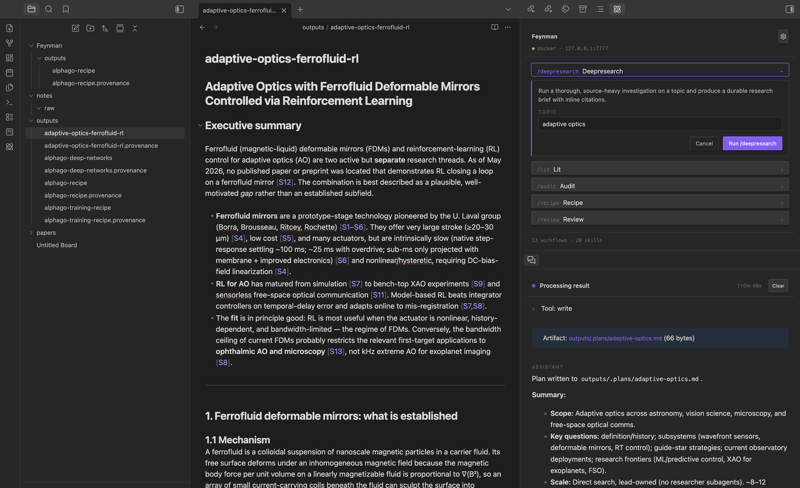

# Feynman for Obsidian

A research agent for your vault. Runs locally in Docker against your own Anthropic API key.



## Requirements

- Obsidian >= 1.5.0
- [Docker Desktop](https://www.docker.com/products/docker-desktop/) installed and running (macOS, Linux, or Windows)
- An [Anthropic API key](https://console.anthropic.com/) (`sk-ant-...`)

## Usage

Once the plugin is installed, configured, and the local Docker server is running:

1. **Open the chat panel.** Click the Feynman ribbon icon, or run **Feynman: Open chat** from the command palette. The panel shows the server's docker status and listens for slash commands.
2. **Pick a workflow.** Type `/` in the input to browse the built-in workflows — `/deepresearch`, `/lit` (literature review), `/audit`, `/recipe`, `/review`, and several others. Each one opens a small form with the arguments it expects (e.g. a `topic` field).
3. **Run it.** Submit the form and the agent streams its progress into the panel: tool calls, intermediate reasoning, and citations as they come in. You can cancel at any point.
4. **Approve tool calls.** When the agent wants to write a file, fetch a paper, or invoke another tool, a modal pops up with the exact command and target path. **Deny** is focused by default — nothing runs without your explicit click.
5. **Find your artifacts.** Finished outputs land in `<vault>/Feynman/outputs/`, `<vault>/Feynman/notes/`, and `<vault>/Feynman/papers/` as regular markdown files. Click the artifact link in the chat panel to jump straight to the file in Obsidian.

You can also invoke a workflow directly from the command palette (e.g. **Feynman: Deep research…**) without opening the chat panel first — useful when a vault note is the topic and you want to pass `activeFile` or the current selection as context.

## Install

### Option A — build from source

```sh
git clone https://github.com/icarian-systems/feynman-research-agent.git
cd feynman-research-agent
npm install
npm run build
```

Then copy `main.js`, `manifest.json`, and `styles.css` into your vault at:

```
<vault>/.obsidian/plugins/feynman-research-agent/
```

Reload Obsidian, open **Settings → Community plugins**, and enable **Feynman**.

### Option B — BRAT (no local build)

If you'd rather not build locally, install via [BRAT](https://github.com/TfTHacker/obsidian42-brat): add this repository as a beta plugin and BRAT will fetch the release artifacts for you.

## Quick start

After enabling the plugin, follow [`docs/SETUP.md`](docs/SETUP.md) to pull the Docker image, configure your Anthropic key, and run your first workflow.

## Privacy & Security

Read this carefully before using the plugin.

- **API keys are stored in plaintext, outside the vault.** Your Anthropic API key (and any optional provider keys you add — OpenAI, Exa, Perplexity, Gemini) are written verbatim to `~/.feynman/secrets.json` (file mode `0600`). The plugin does not encrypt this file. Because secrets live outside the vault, they are **not** carried by Obsidian Sync and are **not** visible to the agent process inside the Docker container's bind mount. Non-secret settings (model preferences, workspace folder, etc.) still live in `<vault>/.obsidian/plugins/feynman-research-agent/data.json`.
- **The server runs on loopback by default.** The plugin talks to a Docker container bound to `127.0.0.1`. There is no cloud/managed-Modal tier shipped in v1 — that mode is disabled in settings until a later release.
- **A random bearer token guards the loopback server.** On first **Set up Docker** the plugin mints a 32-byte hex `FEYNMAN_AUTH_TOKEN` and writes it into the container env-file. Without that header any other process on your machine (browser tabs included) gets `401 Unauthorized` from `http://127.0.0.1:7777`. Self-hosted users must set the same env var on their server and paste the value into Settings.
- **Self-hosted base URLs are HTTPS-only outside loopback.** The settings UI rejects `http://` for any host that isn't `127.0.0.1`, `localhost`, or `::1`, so the bearer token doesn't fly in plaintext.
- **Outbound LLM traffic goes from your local Docker container directly to Anthropic.** The plugin itself does not forward prompt content, vault content, or tool I/O to any third party.
- **The optional waitlist signup POSTs your email to `api.getwaitlist.com`** (a third-party service) if and only if you submit the waitlist form. The waitlist button is visible in Settings by default; the request is sent only when you submit the form, and you can hide the UI entirely by disabling the waitlist feature flag in Settings.
- **Tool calls require explicit approval.** Any tool the agent wants to run (filesystem write, shell, etc.) surfaces a modal with the actual command and path. **Deny** is the default-focused button.

If you don't want your keys leaving the device on which you typed them, the default setup already keeps them on-device: `~/.feynman/secrets.json` is outside any vault and is never touched by Obsidian Sync.

## Notes on Obsidian APIs

The plugin uses one non-public API to deep-link into its own settings tab from inline "Open settings" affordances (the `app.setting.open()` / `app.setting.openTabById(...)` pair). The calls are wrapped in `try/catch`; if a future Obsidian release removes that surface the plugin falls back to a Notice that says "Open Settings → Community plugins → Feynman". No functionality is lost; the deep link just becomes a manual click.

## License

[MIT](LICENSE).
